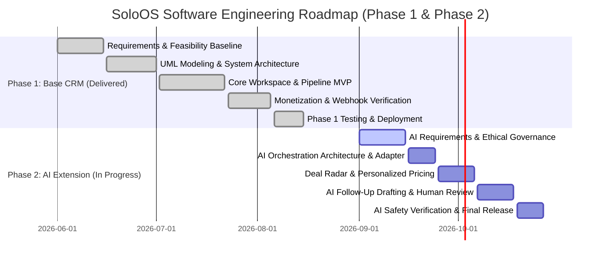

# SoloOS — Project Management Plan

| Version | Date | Author | Change |
|---|---|---|---|
| 0.1 | August 15, 2026 | Anay Sharma | Initial Phase 1 Base CRM project plan baseline and completed schedule |
| 0.2 | September 12, 2026 | Anay Sharma | Extended for Phase 2 AI-Powered CRM Work Breakdown Structure and milestones |

---

## 1. Project Scope & Phased Objectives

### 1.1 Project Objectives
The objective of the SoloOS engineering project is to deliver a production-grade, AI-powered sales workspace specifically tailored for solo freelancers, independent consultants, and micro-agencies.

The project is executed across two distinct phases:
- **Phase 1 (Base CRM — Completed Foundation)**: Delivered the operational single-page client application, multi-stage pipeline, follow-up scheduler, project pricing estimator, proposal tracker, client directory, executive dashboard, and tiered subscription checkout.
- **Phase 2 (AI-Powered CRM — Planned Extension)**: Augments the delivered foundation with Deal Radar prioritization, personalized pricing recommendations, computed client health scoring, human-in-the-loop AI follow-up drafting, and automated weekly revenue debriefs.

### 1.2 Scope Boundaries
- **In-Scope**:
  - Full client-side SPA with responsive desktop, tablet, and mobile layouts.
  - Managed Backend-as-a-Service integration (authentication, relational persistence, RLS).
  - Third-party payment gateway integration with serverless HMAC webhook verification.
  - Asynchronous AI Orchestration Service with hosted AI provider integration.
  - Explicit human-in-the-loop message review and editing UI workflows.
  - Comprehensive data export engine (CSV/JSON).
- **Out-of-Scope**:
  - Autonomous message sending without explicit user approval.
  - Enterprise multi-tier sales team hierarchies, territory routing, or commission splits.
  - Complex double-entry accounting, tax calculation, or payroll management.
  - Native iOS/Android app store wrappers (web-standard responsive PWA focus).

---

## 2. Phased Work Breakdown Structure (WBS)

```
SoloOS Engineering Project
├── Phase 1: Base CRM Foundation (Completed August 15, 2026)
│   ├── 1.0 Requirements & Feasibility Baseline [DONE]
│   │   ├── 1.1 Freelance Problem Discovery & Workflow Research
│   │   ├── 1.2 Economic Feasibility & Unit Cost Modeling
│   │   └── 1.3 IEEE 830 SRS Baseline Specification
│   ├── 2.0 System Architecture & UI/UX Design [DONE]
│   │   ├── 2.1 Formal UML Modeling (Use Cases, Class, ERD, Sequences)
│   │   ├── 2.2 System Design Document & Component Architecture
│   │   └── 2.3 Responsive Component Wireframing & Design Tokens
│   ├── 3.0 Core Client & Backend Implementation [DONE]
│   │   ├── 3.1 Scaffolding, Toolchain (Vite/React/TS) & Auth Setup
│   │   ├── 3.2 Lead Pipeline Module (Kanban Board & List Views)
│   │   ├── 3.3 Follow-Up Scheduler & Urgency Badging Engine
│   │   ├── 3.4 Scoping-Based Pricing Estimator Tool
│   │   ├── 3.5 Proposal Tracker & Automatic Client Record Conversion
│   │   └── 3.6 Executive Sales Dashboard & Revenue Metric Aggregators
│   ├── 4.0 Monetization & Billing Integration [DONE]
│   │   ├── 4.1 Payment Gateway Adapter & Checkout Modal Integration
│   │   └── 4.2 Serverless HMAC Webhook Signature Verification
│   └── 5.0 Foundation Testing & Staging Deployment [DONE]
│       ├── 5.1 Black-Box Functional Verification across all Modules
│       └── 5.2 CDN Deployment Pipeline & Production Promotion
│
└── Phase 2: AI-Powered CRM Extension (In Progress / Prospective)
    ├── 6.0 AI Requirements & Feasibility Evaluation
    │   ├── 6.1 Inference Latency & Asynchronous UI Contract Definition
    │   ├── 6.2 Token Economics & Margin Impact Analysis
    │   └── 6.3 Ethical AI & Human-in-the-Loop Governance Specification
    ├── 7.0 AI Service Layer Architectural Design
    │   ├── 7.1 Extended UML Modeling (Roadmap, AI Sequence, Extended Use Cases)
    │   ├── 7.2 Serverless AI Orchestration Service Architecture
    │   └── 7.3 Hosted AI Provider Adapter Contract (`IAIProvider`)
    ├── 8.0 AI Feature Engineering (Iterative Sprints)
    │   ├── 8.1 Deal Radar Automated Prioritization Engine
    │   ├── 8.2 Personalized Scoping & Pricing Recommendation Engine
    │   ├── 8.3 Computed Client Health Scoring & Churn Risk Detection
    │   ├── 8.4 Context-Aware Follow-Up Drafting with Review Modal
    │   └── 8.5 Automated Asynchronous Weekly Revenue Debrief Generator
    ├── 9.0 AI Verification, Testing & Safety Audits
    │   ├── 9.1 Non-Blocking UI & Provider Timeout Graceful Degradation Testing
    │   ├── 9.2 Human-in-the-Loop Message Edit-Before-Send Verification
    │   └── 9.3 Data Minimization & Privacy Audit (Zero PII Leakage)
    └── 10.0 Rollout & Feature Management
        ├── 10.1 Global AI User Opt-Out Toggle in Account Settings
        └── 10.2 Production Release & Updated User Documentation
```

---

## 3. Milestone Timeline & Schedule

The complete project spans a structured multi-phase timeline:
- **Phase 1 (Base CRM Foundation)**: Executed across 10 weeks, completed August 15, 2026.
- **Phase 2 (AI-Powered CRM Extension)**: Structured across 6 prospective weeks, baseline September 12, 2026.

| Milestone ID | Milestone Description | Status | Target / Completion Date | Deliverables |
|---|---|---|---|---|
| **M1** | Base Requirements & Feasibility Baseline | Completed | June 15, 2026 | `01_Feasibility_Study.md`, `02_SRS.md` v0.1 |
| **M2** | Architecture & UI/UX Design Lock | Completed | July 1, 2026 | `UML.md` Diagrams 1–8, `03_System_Design_Document.md` v0.1 |
| **M3** | Core Pipeline, Follow-Ups & Pricing MVP | Completed | July 22, 2026 | Functional Lead, Follow-Up, and Pricing modules |
| **M4** | Monetization & Payment Gateway Integration | Completed | August 5, 2026 | Subscription checkout, signed webhook handler |
| **M5** | Phase 1 Verification & Production Deployment | Completed | August 15, 2026 | Phase 1 Production Release, Base Docs |
| **M6** | Phase 2 AI Specification & Architecture Lock | Current / In Progress | September 15, 2026 | `UML.md` Diagrams 9–12, Extended SRS v0.2, SDD v0.2 |
| **M7** | AI Service Layer & Deal Radar Implementation | Planned | September 29, 2026 | Serverless AI Orchestration, Deal Radar UI |
| **M8** | AI Follow-Up Drafting & Review Modal | Planned | October 13, 2026 | Human-in-the-loop review workflow, Health Scoring |
| **M9** | AI Verification, Privacy Audit & Final Sign-Off| Planned | October 27, 2026 | Executed Test Report, Phase 2 Full Rollout |

### Comprehensive Phased Gantt Schedule



---

## 4. Team Organization & Project Governance

- **Project Lead & Full-Stack Architect**: **Anay Sharma**
  - Scope definition, architectural governance, full-stack implementation, payment and AI provider integration, quality assurance verification, and technical documentation authoring.
- **Contact & Inquiries**: anaysharmabiz@gmail.com
- **Repository**: https://github.com/AnaySharmaCEO/SoloOS

---

## 5. Risk Summary & Linkage to Risk Management Plan

The project actively monitors both foundational software risks and Phase 2 AI-specific risks. The detailed 5x5 probability-impact analysis, complete mitigations, and operational contingency runbooks are fully articulated in [docs/13_Risk_Management_Plan.md](13_Risk_Management_Plan.md).

| Risk ID | Risk Description | Category | Likelihood | Impact | Summary Mitigation Strategy |
|---|---|---|---|---|---|
| **RSK-01** | **Payment Webhook Delay / Network Partition** | Technical | Medium | High | Rely strictly on server-verified HMAC webhooks; implement asynchronous client polling for confirmation. |
| **RSK-02** | **Third-Party Service Downtime (BaaS / Identity)** | Technical | Low | High | Enforce client-side error boundaries, offline detection, and read-only cache fallback. |
| **RSK-03** | **Scope Creep into Enterprise CRM / Complex Accounting**| Operational | High | Medium | Enforce strict boundary: SoloOS focuses exclusively on pre-sale pipeline and lightweight client records. |
| **RSK-04** | **Hosted AI Provider Latency Spikes / Rate Limiting** | Technical | Medium | Medium | Decouple AI calls asynchronously; enforce graceful degradation where the base CRM remains 100% operational. |
| **RSK-05** | **Freelancer Distrust in Automated AI Communication** | Operational | High | High | Implement strict human-in-the-loop approval: the system never transmits messages autonomously. |

---

## 6. Project Communication & Collaboration Protocols

- **Engineering Repository**: GitHub (`https://github.com/AnaySharmaCEO/SoloOS`) for version control, issue tracking, and milestone management.
- **Documentation Baselining**: All specifications are tracked in markdown within `/docs` alongside the code repository.
- **Incident & Defect Logging**: GitHub Issues categorized by severity (Blocker, Critical, Major, Minor).

---

## 7. Change Management Process

To preserve architectural integrity across both phases:
1. **Change Request Formulation**: Any modification to functional requirements or data contracts must be documented in a structured change request.
2. **Impact Analysis**: The change is evaluated against the 18-document traceability matrix ([docs/11_Requirements_Traceability_Matrix.md](11_Requirements_Traceability_Matrix.md)) to identify impacted modules, diagrams, and test cases.
3. **Documentation Synchronization**: Approved changes increment the document version in the version-history table (e.g., `0.1` -> `0.2`) across the SRS, SDD, and UML models before implementation.
