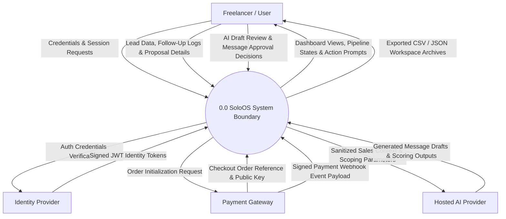
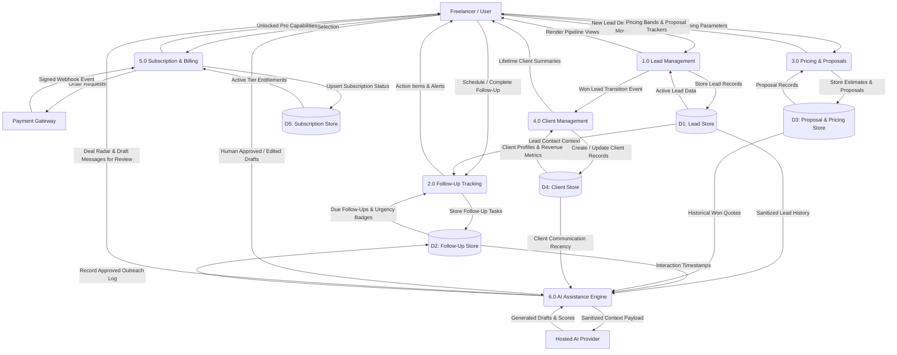

# SoloOS — Data Flow Diagrams (DFD)

| Version | Date | Author | Change |
|---|---|---|---|
| 0.1 | August 15, 2026 | Anay Sharma | Initial Phase 1 Base CRM Data Flow Diagrams (Level 0 and Level 1) |
| 0.2 | September 12, 2026 | Anay Sharma | Extended Level 0 Context and Level 1 DFD with AI Assistance Subsystem |

---

## 1. Introduction & DFD Modeling Notation

Data Flow Diagrams (DFDs) represent the functional perspective of **SoloOS** using structured analysis methodologies. Distinct from Unified Modeling Language (UML) object-oriented diagrams, DFDs trace how data enters the system, transforms through discrete processes, moves between conceptual data stores, and returns to external entities.

### 1.1 Standard DFD Notational Conventions (Gane & Sarson Approximation in Mermaid)
- **External Entities (Source / Sink)**: Represented as rectangular nodes (`[Entity]`). These are agents outside the system boundary that supply or consume data.
- **Processes**: Represented as rounded rectangles (`(Process)`). These perform data transformations or business computations.
- **Data Stores**: Represented as bracketed database blocks (`[(Data Store)]`). These represent persistent collections of business records at a conceptual level (never physical SQL tables).
- **Data Flows**: Represented as labeled directional arrows (`-->|Data Item|`) indicating information movement.

---

## 2. Level 0: Context Diagram (System Overview)

The Level 0 Context Diagram establishes the total system boundary for SoloOS as a single process interacting with four external entities: the Freelancer (User), the Identity Provider, the Payment Gateway, and the Hosted AI Provider.

---

## 3. Level 1: Subsystem Data Flow Decomposition

The Level 1 DFD decomposes the central process `0.0` into six core functional subsystems, illustrating inter-process data exchange and interactions with five conceptual data stores.

### Subsystems (Processes)
- **1.0 Lead Management**: Captures, validates, and updates lead pipeline records.
- **2.0 Follow-Up Tracking**: Calculates due dates, surfaces urgency alerts, and logs completed outreach.
- **3.0 Pricing & Proposals**: Computes scoping price bands and tracks sent client proposals.
- **4.0 Client Management**: Ingests converted won leads into permanent client relationship records.
- **5.0 Subscription & Billing**: Manages checkout sessions and verifies webhook events.
- **6.0 AI Assistance Engine**: Computes Deal Radar rankings, client health scores, personalized pricing, and follow-up drafts with mandatory human-in-the-loop review.

### Conceptual Data Stores
- **D1 Lead Store**: Persistent lead entities, stages, contact histories, and notes.
- **D2 Follow-Up Store**: Scheduled outreach tasks, urgency classifications, and activity logs.
- **D3 Proposal & Pricing Store**: Pricing calculation scopes, quotes, and contract statuses.
- **D4 Client Store**: Permanent client accounts, relationship health, and cumulative revenue.
- **D5 Subscription Store**: User subscription tiers, billing cycles, and renewal timestamps.

---

## 4. Data Dictionary Cross-Reference

All data elements and data store attributes depicted in these diagrams are formally defined in [docs/10_Data_Dictionary.md](10_Data_Dictionary.md).
