# SoloOS — UML Diagrams

**Status:** Diagrams 1-8 document **Phase 1 (Base CRM)**, the completed
foundation. Diagrams 9-12 document **Phase 2 (AI-Powered CRM)**, the
in-progress extension that adds AI-assisted selling capabilities on top
of that foundation — kept as separate, additional diagrams rather than
edits to 1-8, so the evolution of the system is visible rather than
overwritten (see `doc_creation.md`, Rule 6).

All diagrams are logical/conceptual by intent — they describe entities,
behavior, and flow, not literal database tables, columns, or internal
service implementations, and (for Phase 2) not actual prompts, model
names, or fabricated accuracy figures. This is deliberate: these
diagrams are safe to keep in a public/academic repo alongside UI code
without exposing schema, business-rule, or AI-implementation internals.
See `doc_creation.md` for the rules this follows.

All diagrams are Mermaid — they render natively on GitHub/GitLab and most
IDEs with a Mermaid plugin. Every node/participant/class ID below is
unique across the *entire document*, not just within its own diagram —
reusing short IDs like `App` or `User` across multiple diagrams on the
same page is a common, well-documented cause of later diagrams silently
failing to render when several Mermaid blocks share one page.

---

## Part 1 — Phase 1: Base CRM (foundation, complete)

## 1. Use Case Diagram — Base CRM (Phase 1 Foundation)

Follows standard UML Use Case modeling conventions:
- **System Boundary**: A clearly defined boundary rectangle enclosing internal application capabilities.
- **Actors**: External entities placed outside the boundary (Primary Actor on the left; Secondary/Supporting Systems on the right).
- **Use Cases**: High-level action-oriented goals represented as ovals (`([Use Case])`) inside the boundary.
- **Associations**: Solid lines (`---`) representing participation without directional arrows.
- **Dependencies**: Dashed arrows indicating `«include»` (mandatory prerequisite) and `«extend»` (conditional/optional addition).

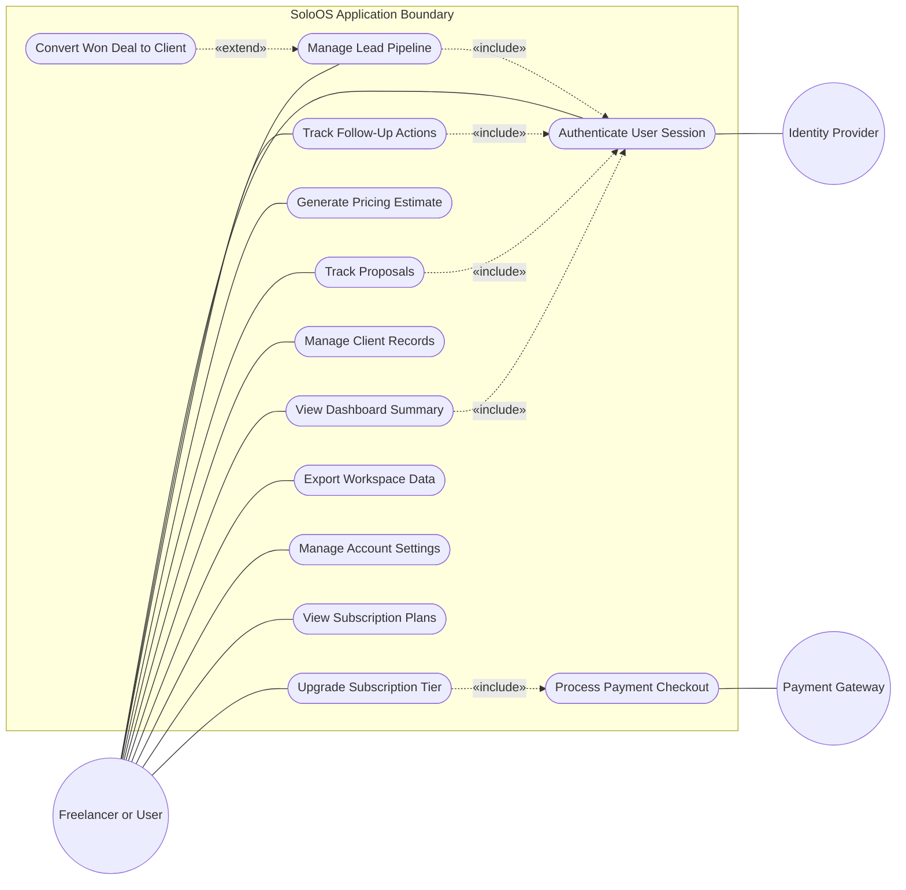

---

## 2. Conceptual Class Diagram (domain model)

Attributes are described at a conceptual level (what the concept *is*),
not as literal column names or types — the physical schema is an
implementation detail that lives outside this documentation set.

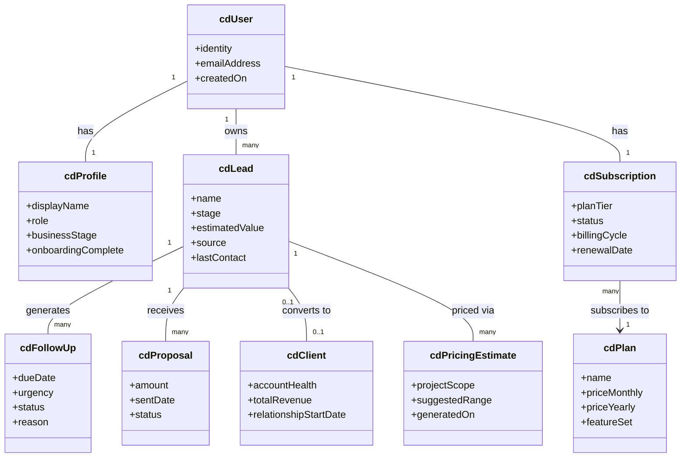

---

## 3. Entity Relationship Diagram (logical, not physical schema)

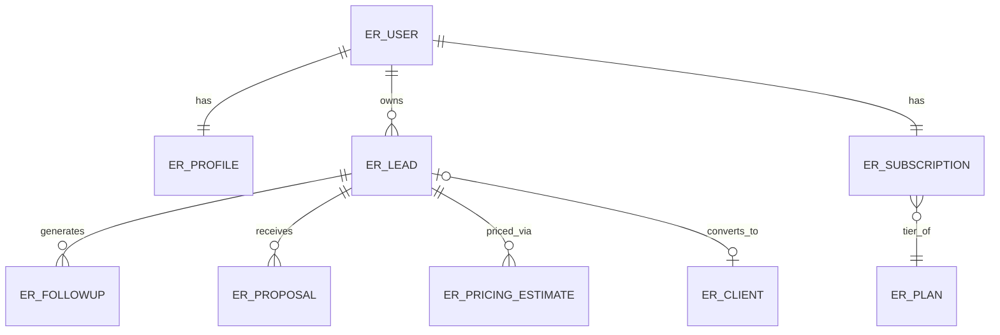

*Note: this describes relationships and cardinality only. Primary/foreign
key names, indexes, and constraints are physical schema detail and are
intentionally excluded — see `doc_creation.md`, Rule 2.*

---

## 4. Sequence Diagram — Lead-to-Client Core Flow

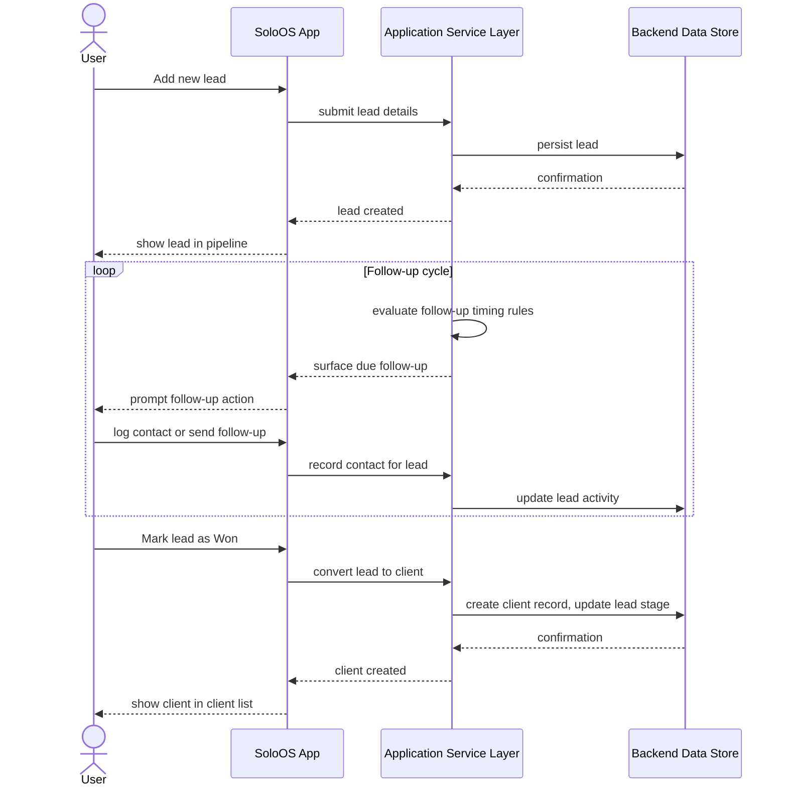

---

## 5. Sequence Diagram — Subscription Checkout Flow

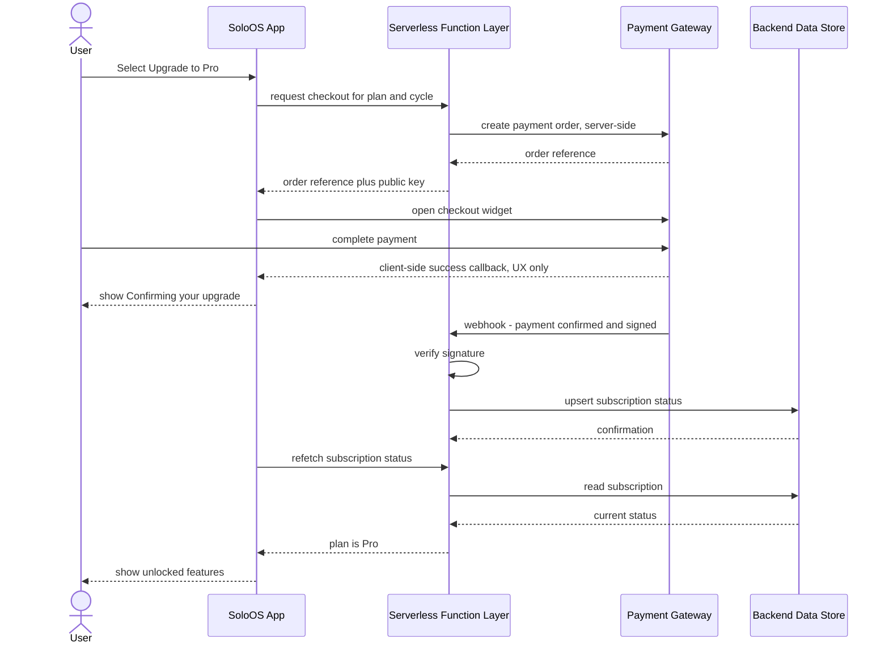

*Note: the webhook path is the only trusted source of truth for payment
confirmation — the client-side callback only drives UI feedback. See the
Architecture / System Design Document for the reasoning.*

---

## 6. State Diagram — Lead Lifecycle

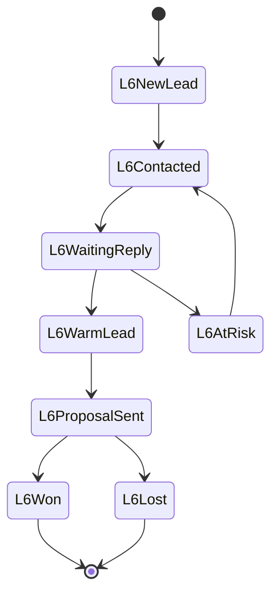

---

## 7. State Diagram — Subscription Lifecycle

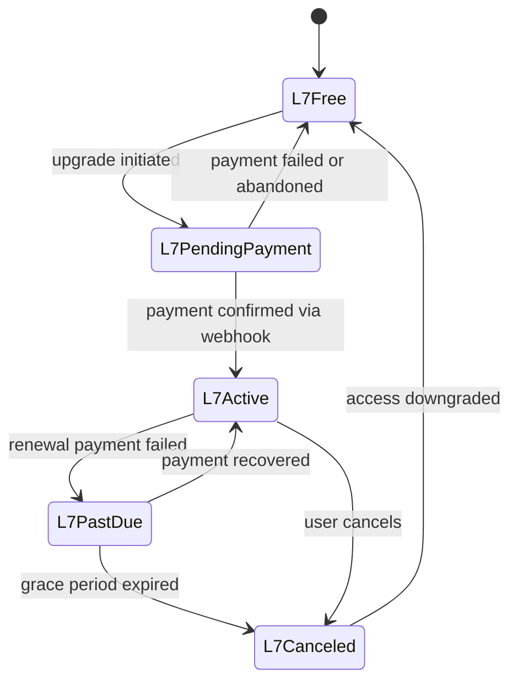

---

## 8. Component / Architecture Diagram (logical)

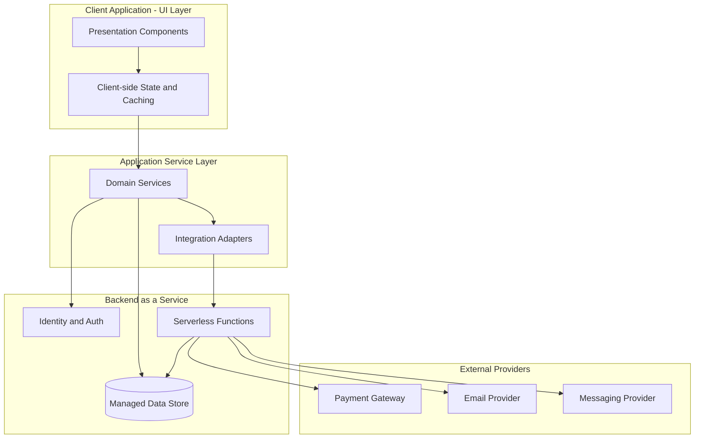

*This diagram documents architectural layering and data-flow direction
only. It intentionally does not name specific tables, endpoints, or
vendor SDK calls — those belong in implementation-level docs outside this
repo, per `doc_creation.md`.*

---

## Part 2 — Phase 2: AI-Powered CRM (in progress)

The diagrams below specify what Phase 2 is adding, not what already
exists. Every AI capability shown here is planned, not built — see
`doc_creation.md`'s tense rule. Human review is deliberately shown as
part of every AI flow: the system drafts and suggests, the user decides.

## 9. Roadmap — Phase 1 to Phase 2

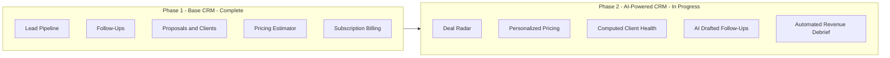

---

## 10. Extended Use Case Diagram — AI-Assisted Selling (Phase 2)

Additive to Diagram 1 — models the AI-assisted selling subsystem boundary, the primary freelancer actor, the secondary hosted AI provider, and the core AI use cases with explicit human-in-the-loop review semantics.

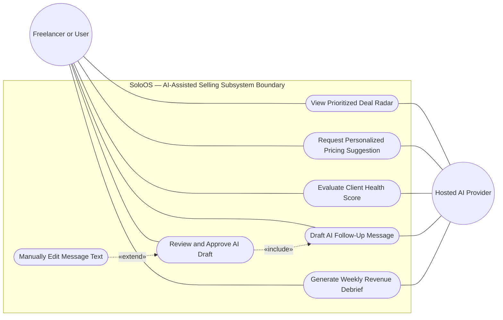

---

## 11. Extended Architecture — AI Service Layer

Additive to Diagram 8 — the same layering, with an AI Orchestration
Service added to the Application Service Layer and a Hosted AI Provider
added alongside the existing external providers. Kept as a full diagram
rather than an edit to Diagram 8 so both states of the architecture
remain visible.

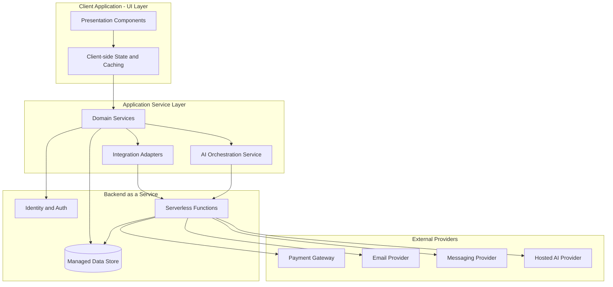

*As with Diagram 8, this names a technology category ("Hosted AI
Provider"), not a specific vendor or model — consistent with
`doc_creation.md` Rule 2a.*

---

## 12. Sequence Diagram — AI-Assisted Follow-Up Drafting

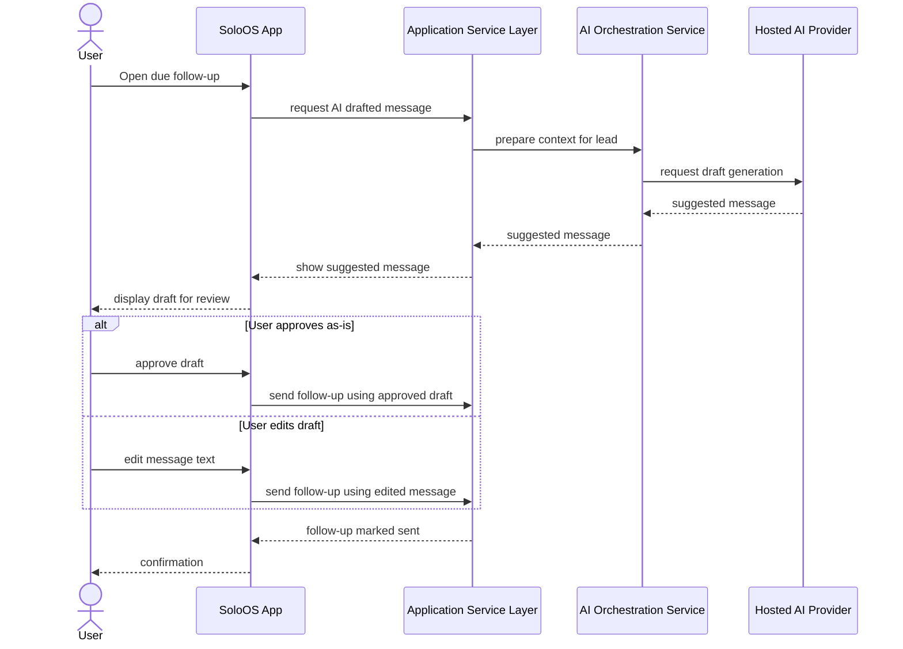

*The user reviews and can edit every AI-drafted message before it sends
— nothing goes out on the user's behalf without confirmation. This is
the flow the AI Ethics and Data Privacy document (`doc_creation.md`,
document 17) should reference as the concrete mechanism behind its
"AI suggestions are advisory and human-reviewed" statement.*

